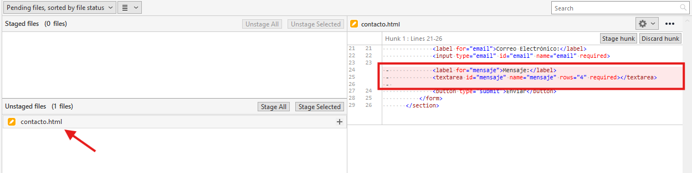
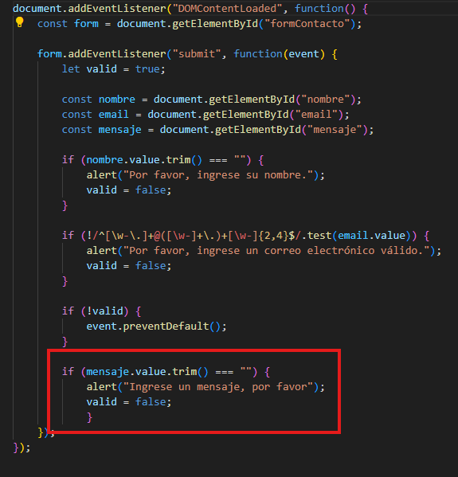
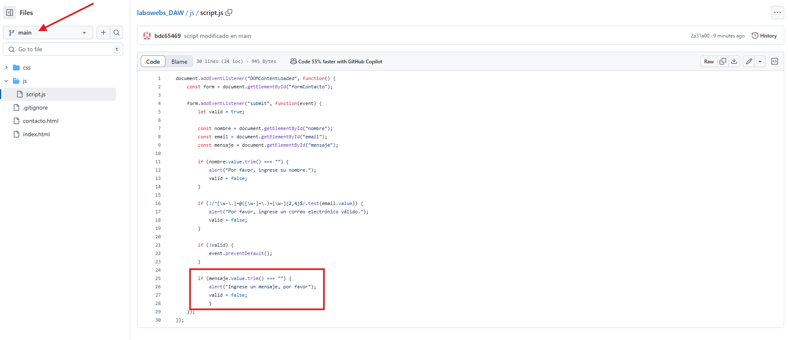

# Ejercicio de git - Proyecto labowebs 

> Gerald Alexis Rueda Tejedo

[TOC]


<u>**URL al repositorio Github: https://github.com/bdc65469/labowebs_DAW.git**</u>

<div style="page-break-after: always; break-after: page;"></div>


## Trabajo en local

### Cuestiones

1. **Inicializa un nuevo repositorio Git en una carpeta llamada `"labowebs"` y agrega los archivos proporcionados en el aula virtual. Renombra la rama master a `main`, si es necesario. Realiza el primer commit. Muestra el log del repositorio.**

   ```bash
   git init
   git add .
   git commit -m "Primer commit"
   git log
   ```

   

   

   

2. **Incluye un fichero `.gitignore` para que los ficheros `README.md` , `LICENCE.txt` y `passwords.txt` sean ignorados por el control de versiones. Realiza el commit y muestra los logs del repositorio en una línea.**

   ```bash
   gedit .gitignore
   git add .gitigore
   git commit -m ".gitignore añadido"
   git log --oneline
   ```

   

   

   

3. **En el repositorio, crea los archivos `README.md` , `LICENCE.txt` y `passwords.txt` con algún contenido. Muestra el estado del repositorio. Muestra el listado de archivos ignorados.**

     ```bash
     echo "Este es el archivo readme" > README.md
     echo "Este es el archivo de licencias" > LICENCE.txt
     echo "Este es el archivo de password" > password.txt
     git status
     git ls-files --others --ignored --exclude-standard
     ```

     

     

     

     

4. **Crea una rama `feature-estilos` . Cámbiate a ella.** 

     ```bash
     git checkout -b feature-estilos
     ```

     

     - Modifica el archivo estilos.css :

       -   propiedad color del `body` y de `h2` : #2a2a2a

       -   propiedad `background-color` de `header` y `footer`: `#2a75ff`

         

       -   Comprueba el estado del repositorio. Añade los cambios, realiza un commit con el mensaje "actualizados estilos a azules"

         ```bash
         git status
         git add css/estilos.css
         git commit -m "actualizados estilos a azules"
         ```

         
         
         

5. **Vuelve a la rama `main` . En el archivo `index.htm`l añade un comentario donde se indique tu nombre como autor de la página. Comprueba el estado del repositorio. Añade los cambios, realiza un commit con el mensaje ' añadido autor en index'. Muestra los logs del repositorio en una línea, gráficamente y con 'decoración'**

     ```bash
     git checkout main
     git status
     git add index.html
     git commit -m "añadido autor en index"
     git log --oneline --graph --all -decorate
     ```

     

     

     

     

     

6. **Fusiona la rama `feature-estilos` en la rama `main` . Muestra los logs del repositorio en una línea, gráficamente y con 'decoración'**

     ```bash
     git merge feature-estilos
     git log --oneline --graph --all -decorate
     
     ```

     


<div style="page-break-after: always; break-after: page;"></div>


## Trabajo en remoto

### Cuestiones

1. **Continúa con el repositorio `labowebs` . Añade el repositorio a Sourcetree**

   

2. **Crea un repositorio remoto y sube al remoto los ficheros de tu repositorio local. Debes subir todas las ramas.**

  

  Configurar el repositorio remoto

  

  

  Para subirlo clicamos en el boton `push`

  

  

  Añadimos las dos ramas

  

  Ya esta subido


  


3. **Crea una rama `feature-index` . Añade el siguiente código dentro de la `<section class="about">` . Añade los cambios y crea un commit. Sube los cambios al remoto.**

  Para crear una nueva rama, clicamos en el boton `branch` y escribimos el nombre de la rama

  

  

  Para añadir los cambios

  

  Para hacer el commit

  

  Vemos los cambios

  

  Para subirlos al remoto, clicamos en el boton `push` y elegimos la rama/s que queremos subir

  

  

4. **En el repositorio local, fusiona la rama `feature-index` en la rama `main` .**

   Nos movemos a la rama donde queremos aplicar los cambios, para ello damos click derecho sobrea la rama y pulsamos en ceckout <nombre de la rama>

   

   Ahora debemos hacer click derecho sobre la rama que queremos fusionar y le damos a la opción de merge

   

   

   

   

5. **Edita el fichero contacto.html . Borra unas líneas. Muestra los ficheros con cambios pendientes y las diferencias. Añade los cambios y haz un commit.**

   Vamos a borrar lo siguiente

   

   

   Vamos añadir los cambios y a hacer un commit

   

   

   

6. **Te das cuenta del error. Deshaz el commit anterior. Captura el estado actual del repositorio.**

   Para revertir un commit damos click derecho sobre el commit y le damos a la opción de reverse commit

   

   

   

   

7. **Crea una rama `feature-mapa` . Incluye este código en el archivo `contacto.html` . Añade los cambios. Realiza un commit. Sube los cambios al remoto. Muestra en el remoto los cambios del archivo `contacto.html` en la rama `feature-mapa` .**

Creamos la rama `feature-mapa`


Añadimos los cambios y hacemos el commit


Ahora vamos a subirlo a nuestro repositorio remoto


Vemos como ya se han subido los cambios a nuestro repositorio remoto 


8.**En GitHub, en la rama `main` , fusiona la rama `feature-mapa` . Baja los cambios del remoto a local. Deja los dos repositorios sincronizados.**


Le damos a `merge pull request`


Confirmamos el merge


Vemos que en la rama `main`, ya están aplicados también los cambios en contacto


Por último vamos a hacer el `pull` para que nuestro repositorio remoto y local tengan el mismo contenido

<div style="page-break-after: always; break-after: page;"></div>


## Conflictos 

### Cuestiones

1. **Crea una rama `hotfix-js` . Cámbiate a ella. Añade este código en el fichero `script.js` .Confirma el cambio y haz un commit. (Fíjate en los números de línea...)**

  Creamos la rama

  

  Añadimos el código nuevo

  

  Añadimos los cambios

  

  Y hacemos el commit

  

  

2. **Vuelve a la rama main . En el fichero script.js en las mismas líneas que en la cuestión anterior, añade el código siguiente. Confirma el cambio y haz un commit.**

  Nos cambiamos a la rama main, para ello click derecho sobre el nombre de la rama y `checkout main`

  

  Modificamos el fichero `script.js`

  

  Añadimos los cambios

  

  Hacemos el commit

  

  

3. **Fusiona la rama `hotfix-js` en `main` . Debe producirse un conflicto. Resuélvelo. Cuando termines la resolución del conflicto sube los cambios al remoto - Deja los repositorios sincronizados -**

  Para fusionar la rama main con la rama `hotfix-js`, nos situamos en la rama main y damos click derecho sobre la rama `hotfix-js` y elegimos la opción `merge hotfix-js into current branch`

  

  

  Y nos muestra que hay un conflicto

  

  Abrimos el visual studio code para resolver el conflicto

  

  Tenemos para opciones para resolver el conflicto, en este caso vamos a aceptar cambio actual

  

  Vemos que se mantiene el último cambio y se resolvió el conflicto

  Por último vamos a hacer el push de la rama main a nuestro repositorio remoto

  

  Vemos como en github se ha subio nuestro fichero `script.js` con la última versión

  
